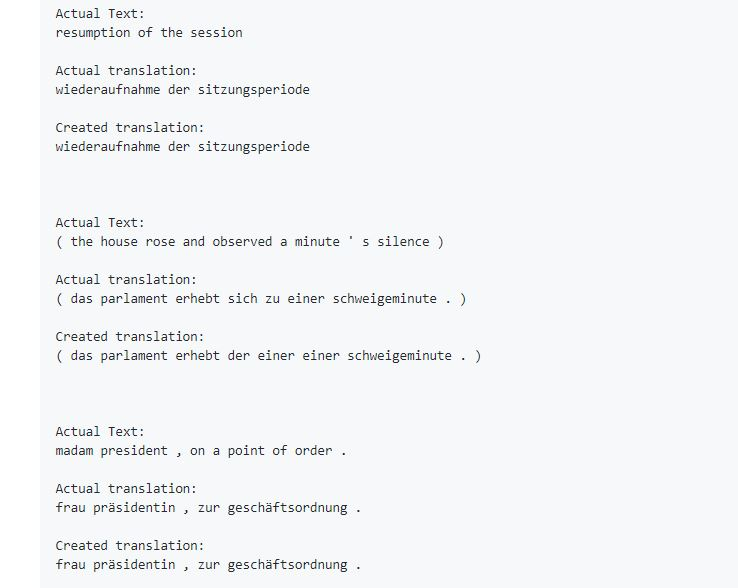

# BahuBhashi
Recently many MNC’s are facing an issue where a customer of a particular region calls in and the customer experiences long wait hours as all the representatives are busy. While their call centers in other regions are not experiencing busy wait hours. To mitigate this issue there could be a system designed which takes an audio input in one language and translates it into another language. This solution could be used where if the call centers in one region are facing high call volumes the calls could be directed to the regions facing lower call volumes and BahuBhashi could be used so that person on both ends can converse in their own language and find a solution to their issue. 

## Dependencies
- [European Parliament Proceedings Parallel Corpus](http://www.statmt.org/europarl/v7/de-en.tgz)
  _(It contains two files. One is the dataset of English Sentences and other is the dataset of German sentences)_
- [TensorFlow v1.9.0](https://www.tensorflow.org/install/#download-and-setup)
- [Python v3.6.2](https://www.python.org/downloads/release/python-370/)
- [Natural Language ToolKit](https://www.nltk.org/)

## Imports Required 
- nmt_data_utils.py
- nmt_model_utils.py
- NMT_Model.py

## Architecture
#### Sequence2Sequence Model
- Bidirectional RNN (LSTM or GRU)
- Bahdanau Attention
- Adam Optimizer
- Beam Search or Greedy Decoding

## Results

## Acknowledgements
- [Thomasschmied - Neural_Machine_Translation_Tensorflow](https://github.com/thomasschmied/Neural_Machine_Translation_Tensorflow)
- [Overcoming the Language Barrier with Speech Translation Technology](http://citeseerx.ist.psu.edu/viewdoc/download?doi=10.1.1.472.1019&rep=rep1&type=pdf)
- [Speech-to-Speech Translation: A Review](https://pdfs.semanticscholar.org/0fa1/911622a6c0a3dd43fefbdf2695ebdb7e10fa.pdf)
- [Speechalator: two-way speech-to-speech translation on a consumer PDA](https://www.cs.cmu.edu/~awb/papers/eurospeech2003/speechalator.pdf)

## License
This project is licensed under the MIT License - see the [LICENSE.md](./LICENSE) file for details

